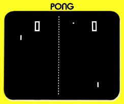

# PONG


## Background
Pong is one of the earliest video games. It was created by Allan Alcorn at Atari in 1972 as a training exercise.

The game consists of a ball and two paddles. Two players attempt to return the ball using the paddlers. A player scores a point if their opponent fails to return the ball. The first player to 11 points wins.

## Implementation
This version of Pong is written in Python. It uses Pygame.

## Limitations
* Game ends when a player reaches 10 points not 11
* At the end of a game, the program stops executing, it does not provide for a new game.

## Installation

Just clone this repository.

```bash
$ git clone https://github.com/richardadalton/python_pong.git
```

## Running Pong

Run the pong_script.py file with python.

```bash
$ python pong_script.py
```
